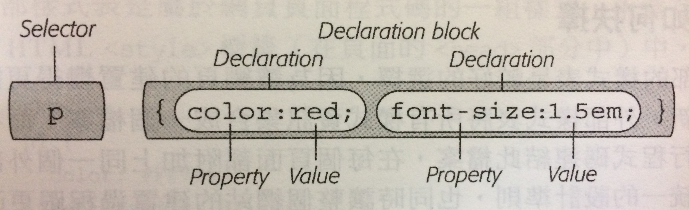
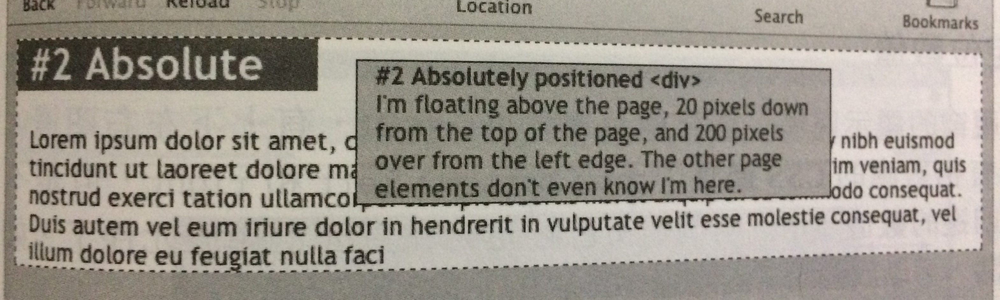
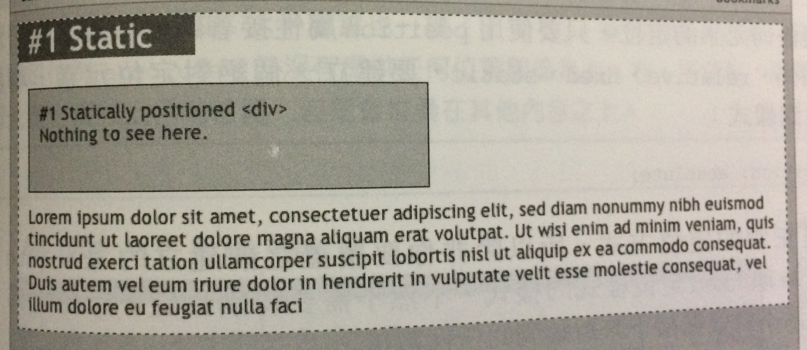
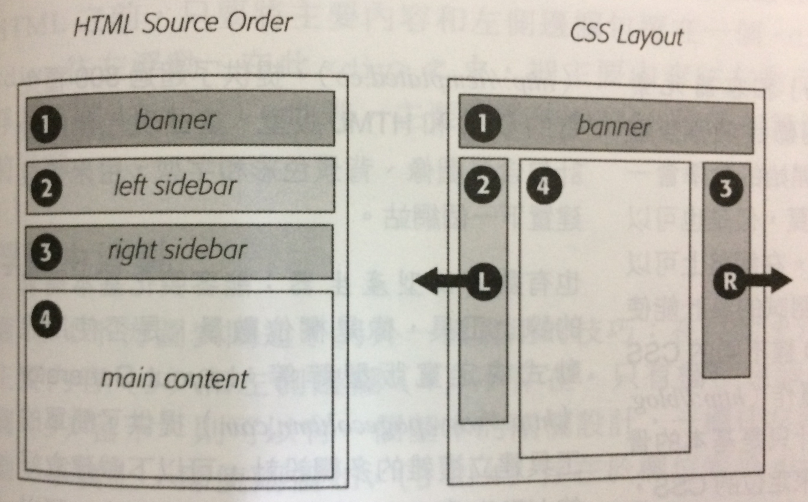

## Table of Contents

[Introduction](#introduction)

  1. [What is CSS](#what-is-css)

[Style Sheets](#stylesheets)

  1. [CSS Syntax](#css-syntax)
  2. [CSS Comments](#css-comments)
  3. [Three Ways to Insert CSS](#three-ways-to-insert-css)

[Selectors](#selector)

[Style Inheritance](#style-inheritance)

[The Cascade](#the-cascade)

[Width and Height](#width-and-height)

  1. [Setting width And height](#setting-width-and-height)
  2. [Setting max-width](#setting-max-width)

[Display](#display)

[Box Model](#box-model)

[Layouts](#layouts)

  1. [Basic Typesetting Methods](#basic-typesetting-methods)
  2. [Float Layout](#float-layout)
  3. [Responsive Web Design](#responsive-web-design)
  4. [Flexbox](#flexbox)

[Form](#form)

[Advanced CSS](#advanced-css)

[Reference Information](#reference-information)

<br />

## Introduction

<a name="what-is-html"></a>
What is CSS ?

  * **階層樣式表 (_Cascading Style Sheets_)**：簡稱 CSS，藉由它來讓以 HTML 為根基的網頁變好看

  * CSS describes how HTML elements are to be displayed on screen, paper, or in other media

**[⬆ back to top](#table-of-contents)**

<br />
<br />

## Style Sheets

<a name="css-syntax"></a>
CSS Syntax

  * 一個樣式定義了頁面上一個元素的外觀，它只是一個規則用來告知瀏覽器，該如何呈現網頁上的一些東西

  * 樣式主要由兩個部分組成：

      - **選擇器 (_Selector_)**：The selector points to the HTML element you want to style.

      - **宣告區塊 (_Declaration Block_)**：The declaration block contains one or more declarations separated by semicolons.

        > declaration blocks are surrounded by curly braces.

        - **宣告 (_Declaration_)**：Each declaration includes a CSS property name and a value, separated by a colon.

        - **屬性 (_Property_)**

        - **值 (_Value_)**

    

**[⬆ back to top](#table-of-contents)**

<br />
<br />

<a name="css-comments"></a>
CSS Comments

  * A CSS comment starts with `/*` and ends with `*/`, Comments can also span multiple lines

    ex :

    ```css
    p {
      color: red;
      /* This is a single-line comment */
      text-align: center;
    }

    /* This is
    a multi-line
    comment */
    ```

**[⬆ back to top](#table-of-contents)**

<br />
<br />

<a name="three-ways-to-insert-css"></a>
Three Ways to Insert CSS

  * 樣式表有三種方式可載入於頁面：

    - **內部樣式表 (_Internal Style Sheet_)**：屬於網頁頁面程式碼的一部分，存在 `<head>` 區塊的 `<style>` 標籤中

      ex :

      ```html
      <html>
        <head>
          <style>

          h1 {
            color: #FF7643;
            font-family: Arial;
          }

          p {
            color: red;
            font-size: 1.5em;
          }

          </style>
        </head>

        <body>

          <!-- The rest of your page follows... -->

        </body>
      </html>
      ```

    - **外部樣式表 (_External style sheet_)**：就是一個副檔名為 `.css` 的樣式表檔案，透過 `<link>` 標籤可以載入指定的樣式表

      ex :

      ```html
      <link rel="stylesheet" href="css/styles.css">
      ```

    - **行內樣式 (_Inline style_)**：即是將樣式撰寫於 HTML 標籤的 `style` 屬性之中

      ex :

      ```html
      <h1 style="color: #6A94CC;">
      ```

**[⬆ back to top](#table-of-contents)**

<br />
<br />

## Selectors

  * 透過選擇器 (_selectors_) 告知 CSS 想要選定哪個元素

  * **類型選擇器 (_Type or Element Selectors_)**：選定頁面上每一個符合該類型的標籤

    ex :

    ```css
    /* 選定該頁面的每一個 <h2> 標籤 */

    h2 {
      color: #000000;
      margin-bottom: 0;
    }
    ```

  * **類別選擇器 (_Class Selectors_)**：選定頁面上每一個標籤的 `class` 屬性中，擁有該類別名稱者

    - 名稱必須以 `.` 開頭

    - `.` 之後必須是字元

    - 名稱只允許使用字元、數字、連字符號 和 底線

    - 名稱有區分大小寫

    - 一個標籤，可賦予多個類別

    ex :

    ```html
    <button class="btn add">Add</button>
    ```

    ```css
    /* 選定該頁面上每一個標籤的 class 屬性中，擁有 .btn 類別者 */

    .btn {
      border-radius: 5px;
    }

    .add {
      background-color: green;
    }
    ```

    > You can also specify that only specific HTML elements should be affected by a class.

    ex :

    ```css
    /* only <p> elements with class="center" will be center-aligned */

    p.center {
      text-align: center;
      color: red;
    }
    ```


  * **ID 選擇器 (ID Selectors)**：The id selector uses the id attribute of an HTML element to select a specific element.

  * The id of an element should be unique within a page

  * To select an element with a specific id, write a hash (#) character, followed by the id of the element.

    > An id name cannot start with a number!

    ex :

    ```html
    <div id="banner">
    ```

    ```css
    /* 選定頁面上標籤的 `id` 屬性中，擁有該 ID 者 */

    #banner {
      background: #CC0000;
      height: 300px;
      width: 720px;
    }
    ```

  * There are four different combinators in CSS3：

    - descendant selector `(space)`

    - child selector `(>)`

    - adjacent sibling selector `(+)`

    - general sibling selector `(~)`

  * **群組選擇器 (_Grouping Selectors_)**：選定頁面上指定的標籤群，賦予相同樣式，可以使用任何有效的選擇器

    ex :

    ```css
    h1, h2, h3, h4, h5, h6 {
      color: #F1CD33;
    }

    /* 各種不同類型的選擇器混搭 */

    h1, p, .copyright, #banner {
      color: #F1CD33;
    }
    ```

  * **全局選擇器 (_Universal Selector_)**：選定頁面上所有的標籤，也可用於後裔選擇器

    ex :

    ```css
    * {
      padding: 0;
      margin: 0;
    }

    /* 選定 .banner 標籤之後的所有後裔標籤 */

    .banner * {
      float: left;
      color: #FFFFFF;
    }
    ```

  * **後裔選擇器 (_Descendant Selector_)**：選定頁面上所有指定的後裔標籤，可以使用任何有效的選擇器

    ex :

    ```css
    /* 選定 li 標籤，的後裔標籤 a */

    li a {
      font-family: Arial;
    }

    /* 選定 .intro 標籤，的後裔標籤 a */
    .intro a {
      color: yellow;
    }
    ```

  * **屬性選擇器 (_Attribute Selector_)**：選定頁面上所有擁有該屬性的標籤

    ex :

    ```css
    /* 選取帶有 title 屬性的  標籤 */

    img[title] {
      color: red;
    }

    /* 選取 href 屬性為 "http://www.cafesoylentgreen.com" 的 <a> 標籤 */

    a[href="http://www.cafesoylentgreen.com"] {
      color: green;
      font-weight: bold;
    }

    /* 選取 type 屬性為 "text" 的 <input> 標籤 */

    input[type="text"] {
      color: black;
    }

    /* 選取 href 屬性開頭為 "https://" 的 <a> 標籤 */

    /* The value has to be a whole word, either alone, like class="top", or followed by a hyphen( - ), like class="top-text" */

    a[href|="https://"] { {
        background: yellow;
    }

    /* 選取 href 屬性開頭為 "https://" 的 <a> 標籤 */

    /* The value does not have to be a whole word */

    a[href^="https://"] {
      font-size: 16px;
    }

    /* 選取 href 屬性開頭為 ".pdf" 的 <a> 標籤 */

    /* The value does not have to be a whole word */

    a[href$=".pdf"] {
      font-weight: 400;
    }

    /* 選取 src 屬性包含 "headshot" 字元的  標籤 */

    /* The value does not have to be a whole word */

    img[src*="headshot"] {
      margin-left: 10px;
    }
    ```

  * **子選擇器 (_Child Selectors_)**：選取指定的子元素標籤，使用 `>` 表示其關係

    ex :

    ```css
    /* 選取 <body> 標籤中所有為子元素的 <h1> 標籤 */

    body > h1 {
      color: #CCCCCC;
    }
    ```

  * **鄰近兄弟選擇器 (_Adjacent Siblings Selectors_)**：選取最鄰近的指定兄弟元素標籤，使用 `+` 表示其關係

    ex :

    ```css
    /* 選取兄弟元素為 <h2> 的 <p> 標籤 */

    h2 + p {
      margin: 0 10px 10px 0;
    }
    ```

  * **通用兄弟選擇器 (_General Sibling Selectors_)**：選取相同層級的所有兄弟元素標籤，使用 `~` 表示其關係

    ex :

    ```css
    /* 選取所有是 <h2> 的兄弟標籤的 <p> 標籤 */

    h2 ~ p {
      margin: 0 10px 10px 0;
    }
    ```

  * **擬類別 (_Pseudo-Classes_)**：A pseudo-class is used to define a special state of an element.

    > `a:hover` MUST come after `a:link` and `a:visited` in the CSS definition in order to be effective `a:active` MUST come after `a:hover` in the CSS definition in order to be effective

    - Pseudo-class names are not case-sensitive.

      ex :

      ```css
      /* 在使用者游標移過 <a> 標籤時，套用樣式 */

      a:hover {
        color: yellow;
        font-weight: 400;
      }
      ```

    - Pseudo-classes can be combined with CSS classes.

      ex :

      ```css
      a.highlight:hover {
        color: #ff0000;
      }
      ```

  * **擬元素 (_Pseudo-Elements_)**：A pseudo-element is used to style specified parts of an element.

    > 擬元素前綴使用 `::`，擬類別則使用 `:`

    ex :

    ```css
    /* 選取 <p> 標籤的第一個字元，套用樣式 */

    /* `::first-letter` pseudo-element can only be applied to block-level elements. */

    p::first-letter {
      color: #ff0000;
      font-size: xx-large;
    }
    ```

    - Pseudo-elements can be combined with CSS classes.

      ex :

      ```css
      p.intro::first-letter {
        color: #ff0000;
        font-size:200%;
      }
      ```

    - Multiple Pseudo-elements：Several pseudo-elements can also be combined.

      ex :

      ```css
      p::first-letter {
        color: #ff0000;
        font-size: xx-large;
      }

      p::first-line {
        color: #0000ff;
        font-variant: small-caps;
      }
      ```

    > 更多可供使用的擬類別 及 擬元素，請參考 [MDN CSS Reference](https://developer.mozilla.org/en-US/docs/Web/CSS/Reference#Selectors)

**[⬆ back to top](#table-of-contents)**

<br />
<br />

## Style Inheritance

  * 祖先元素擁有的屬性，傳遞到後裔元素身上，就稱為繼承 (_Inheritance_)

  * CSS 中不是所有的屬性，都擁有繼承的特性

  > 可在 [MDN Keyword Index](https://developer.mozilla.org/en-US/docs/Web/CSS/Reference#Keyword_index) 中查詢，屬性可繼承

**[⬆ back to top](#table-of-contents)**

<br />
<br />

## The Cascade

  * 管控屬性間互相作用以及衝突時處理的優先權，稱為疊層 (_Cascade_)

  * Where number one has the highest priority：

    - Inline style (inside an HTML element)

    - External and internal style sheets (in the head section)

    - Browser default

    > So, an inline style has the highest priority, which means that it will override a style defined inside the <head> tag, or in an external style sheet, or a browser default value.

  * 累加繼承樣式：繼承一群祖先元素的樣式，而產生的新樣式

    ex :

    ```html
    <body>
      <p>Hi everyone, I'm <strong>Justin</strong></p>
    </body>
    ```

    ```css  
    body {
      font-family: Verdana, Arial;
    }
    p {
      color: #F30000;
    }
    strong {
      font-size: 24px;
    }

    /* <strong> 繼承祖先元素的屬性 font-family、color */

    strong {
      font-family: Verdana, Arial;
      color: #F30000;
      font-size: 24px;
    }
    ```

  * 最鄰近祖先勝出：同一個屬性被多個祖先重複套用

    ex :

    ```html
    <!-- <strong> 標籤的文字內容顏色會是綠色 -->

    <body>
      <p>Hi everyone, I'm <strong>Justin</strong></p>
    </body>
    ```

    ```css
    body {
      color: red;
    }
    p {
      color: green;
    }
    ```

  * 直接套用者勝出：直接套用在標籤上的屬性，會覆蓋掉其他來自祖先元素的相同屬性

    ex :

    ```html
    <!-- <strong> 標籤的文字內容顏色會是藍色 -->

    <body>
      <p>Hi everyone, I'm <strong>Justin</strong></p>
    </body>
    ```

    ```css
    body {
      color: red;
    }
    p {
      color: green;
    }
    strong {
      color: blue;
    }
    ```

  * 優先度最高者勝出：單一標籤，同時被多重樣式套用，瀏覽器將計算出樣式的優先度後，才進行套用

    ex :

    ```html
    <!-- <p> 標籤的文字內容，將會套用藍色 -->

    <body>
      <p id="name" class="intro">Hi everyone, I'm Justin</p>
    </body>
    ```

    ```css

    /* 標籤選擇器 => 1 分 */

    p {
      color: red;
    }

    /* 類別選擇器 => 10 分 */

    .intro {
      color: green;
    }

    /* ID 選擇器 => 100 分 */

    #name {
      color: blue;
    }
    ```

  * 優先度計算

      - 標籤選擇器：1 分

      - 擬元素：1 分

      - 類別選擇器：10 分

      - 屬性選擇器：10 分

      - 擬類別：10 分

      - ID 選擇器：100 分

      - 行內樣式：1000 分

      - 後裔選擇器：將上述各種類型的選擇器分數加總後，就是它的分數

    

  * 位置順序最後的勝出：不同樣式選定相同元素，且優先度相同的情況，位置在最後面的樣式會被採用

    ex :

    ```html
    <!-- <a> 標籤的文字內容將會套用 .byline a 樣式 -->

    <p class="byline">Written by <a class="email" href="mailto:jean@cosmofarmer.com">Jean Graine de Pomme</a></p>
    ```

    ```css
    p .email {
      color: blue;
    }

    .byline a {
      color: red;  
    }
    ```

  * 推翻優先度：使用 `!important` 可以強制指定屬性的優先度為最高

    ex :

    ```html
    <!-- <a> 標籤的文字內容將會套用 p .email 樣式 -->

    <p class="byline">Written by <a class="email" href="mailto:jean@cosmofarmer.com">Jean Graine de Pomme</a></p>
    ```

    ```css
    /* 下列兩個樣式優先度計算後都是 11 分，但是擁有 `!important` 的屬性優先度會是最高，因此它會被採用 */

    p .email {
      color: blue !important;
    }

    .byline a {
      color: red;  
    }
    ```

**[⬆ back to top](#table-of-contents)**

<br />
<br />

## Width and Height

<a name="setting-width-and-height"></a>
Setting width And height

  * The `height` and `width` properties are used to set the height and width of an element.

  * The `height` and `width` can be set to auto (this is default. Means that the browser calculates the height and width), or be specified in length values, like px, cm, etc., or in percent (%) of the containing block.

    ex :

    ```css
    div {
      height: 200px;
      width: 50%;
    }
    ```

**[⬆ back to top](#table-of-contents)**

<br />
<br />

<a name="setting-max-width"></a>
Setting max-width

  * The `max-width` property is used to set the maximum width of an element.

  * The `max-width` can be specified in length values, like px, cm, etc., or in percent (%) of the containing block, or set to none (this is default. Means that there is no maximum width).

  * The value of the `max-width` property overrides `width`.

  * You can set the margins to auto, to horizontally center the element within its container.

**[⬆ back to top](#table-of-contents)**

<br />
<br />

## Display

  * The `display` property specifies if/how an element is displayed.

  * Every HTML element has a default display value depending on what type of element it is. The default display value for most elements is `block` or `inline`.

  * `inline-block` elements are like `inline` elements but they can have a width and a height.

  * Hiding an element can be done by setting the `display` property to `none`, `visibility: hidden` also hides an element. However, the element will still take up the same space as before. The element will be hidden, but still affect the layout.

  * Setting the display property of an element only changes how the element is displayed, **NOT** what kind of element it is. So, an inline element with `display: block` is not allowed to have other block elements inside it.

## Box Model

  * **區塊模型 (_Box Model_)**：All HTML elements can be considered as boxes, It consists of：margins, borders, padding, and the actual content.

    

  * Explanation of the different parts：

    - Margin：Clears an area outside the border. The margin is transparent

    - Border：A border that goes around the padding and content

    - Padding：Clears an area around the content. The padding is transparent

    - Content：The content of the box, where text and images appear

  * 外距、內距屬性值的單位，如果是 `%` 瀏覽器則會根據外層元素的寬度來計算間距寬度

    > 外層元素即為包覆在指定元素向外一層的元素，在沒有設定寬度的外層元素中則會根據瀏覽器視窗大小改變

  * 外距、內距簡寫寫法如下：

    ex :

    ```css
    /* 四邊都不同：上、右、下、左 */

    .box {
      padding: 0 10px 10px 20px;
    }

    /* 上下邊和左右邊：上和下、左和右 */

    .box {
      padding: 10px 20px;
    }

    /* 左右邊相同，上下邊不同：上、左和右、下 */

    .box {
      padding: 5px 20px 8px;
    }

    /* 四邊都相同 */

    .box {
      padding: 10px;
      margin: 0;
    }
    ```

    > 屬性值為 0，單位可以不寫

  * 外距、內距屬性值可以是負數

    ex :

    ```css
    .box {
      padding: -10px;
      margin: -5%;
    }
    ```

  * 行內元素 (_Inline Elements_) 只有左右內、外距，不能使用上下內、外距

  * 行內元素可以使用 `display` 屬性，改變成區塊等級元素、行內區塊...等等

  * 邊線簡寫寫法如下：

    ```css
    /* border 屬性值的順序不會影響結果 */

    .box {
      border: 4px solid rgb(255, 0, 0);
    }

    .box {
      border: solid rgb(255, 0, 0) 4px;
    }

    /* 為個別邊線套用樣式 */

    .box {
      border: 2px solid red;
      border-bottom: 4px dashed #333333;
    }

    /* 可以使用 none 屬性值，取消邊線 */

    .box {
      border: 2px solid red;
      border-bottom: none;
    }
    ```

  * 內容區塊 (_Content Area_) 的寬、高，可以透過 `width` 和 `height` 屬性設定

    ex :

    ```css
    .box {
      width: 50px;
      height: 80px;
    }
    ```

  * 預設的區塊模型實際的寬度計算為，外距、邊線、內距和內容區塊寬度的總和

    ex :

    ```css
    /* 寬度總和為 160px */

    .box {
      width: 100px;
      padding: 15px;
      border-width: 5px;
      margin: 10px;
    }
    ```

  * 改變瀏覽器計算元素寬度的方式，可以使用 `box-sizing` 屬性，屬性值如下：

    - content-box：瀏覽器預設的模式

    - padding-box：瀏覽器會將內距的寬度納入到內容區塊

      ex :

      ```css
      /* 元素寬度總和為 100px，其中內容區塊為：60px (100px-20px-20px) */

      .box {
        box-sizing: padding-box;
        width: 100px;
        padding: 0 20px;
      }
      ```

    - border-box：瀏覽器會將內距、邊線的寬度納入到內容區塊

      ex :

      ```css
      /* 元素寬度總和為 100px，其中內容區塊為：50px (100px-20px-20px-5px-5px) */

      .box {
        box-sizing: padding-box;
        width: 100px;
        padding: 0 20px;
        border: 5px solid blue;
      }
      ```

  * 內容區塊大於樣式所設定的寬高時，內容區塊中的內容會溢出 box 區域，可使用 `overflow` 屬性控制

    > The `overflow` property only works for block elements with a specified height.

    - visible：瀏覽器的預設設定，內容會溢出 box 區域

    - scroll：增加捲軸在元素中，使內容不會溢出 (even if you do not need it)

    - auto：同 scroll，但捲軸只在需要時顯示

    - hidden：隱藏所有溢出 box 的內容

  * The `overflow-x` and `overflow-y` properties specifies whether to change the overflow of content just horizontally or vertically (or both)

    - `overflow-x` specifies what to do with the left/right edges of the content.

    - `overflow-y` specifies what to do with the top/bottom edges of the content.

  * 設定元素的寬、高最大值和最小值

    - max-width

    - min-width

    - max-height

    - min-height

**[⬆ back to top](#table-of-contents)**

<br />
<br />

## Layouts

<a name="basic-typesetting-methods"></a>
Basic Typesetting Methods

  * `position` 屬性能設定元素的定位方式，並透過 `top`、`bottom`、`left`、`right` 指定元素具體位置

      - 絕對 (_Absolute_)：將元素透過絕對方式定位 (元素重疊時，絕對定位元素不會干擾到其他元素)

        

      - 相對 (_Relative_)：根據元素原始位置的相對方向做定位，相對定位元素會在自己的原始位置保留一個 "洞"

        

      - 固定 (_Fixed_)：將元素固定鎖在螢幕上的指定位置，滾動頁面時會跟著移動

        

      - 靜態 (_Static_)：元素預設的定位方式

        

        > `top`、`bottom`、`left`、`right` 不會作用在靜態定位元素上

  * `float` 和 `position: 非 static` 無法同時存在同一個元素

  * 瀏覽器視窗的顯示區域稱為 viewport 有上下左右四邊，對應到 CSS 屬性 `top`、`bottom`、`left`、`right`

  * 絕對定位元素包含另一個絕對定位元素 (子元素)，該子元素會根據父元素的四個邊做絕對定位，而不是根據瀏覽器視窗

  * 絕對定位元素的位置，會根據該元素在何種元素之中而做改變

      - 元素相對於瀏覽器視窗定位：此情況發生在，絕對定位元素不在絕對、相對、固定定位元素之中

      - 元素相對於其他元素的邊緣：此情況發生在，元素在絕對、相對、固定定位元素之中

  * When elements are positioned, they can overlap other elements.

  * 堆疊元素：絕對定位元素會在其他定位元素之上或之下，元素的堆疊順序可透過 `z-index` 屬性控制

  * An element can have a positive or negative stack order.

    ex :

    ```css
    img {
      position: absolute;
      left: 0px;
      top: 0px;
      z-index: -1;
    }
    ```

  * An element with greater stack order is always in front of an element with a lower stack order.

  * If two positioned elements overlap without a `z-index` specified, the element positioned last in the HTML code will be shown on top.

  * To horizontally center a block element, use `margin: auto`. The element will then take up the specified width, and the remaining space will be split equally between the two margins.

    > Center aligning has no effect if the width property is not set (or set to 100%).

**[⬆ back to top](#table-of-contents)**

<br />
<br />

<a name="float-layout"></a>
Float Layout

  * 透過 `float` 屬性可使元素成為浮動元素，在浮動元素下方的元素都會往上移動，達到文繞圖的效果

    > 浮動元素會根據 HTML source order 做浮動，如果元素在浮動元素之前，則不會被影響到

    

  * `float` 接受三種不同的值 `left`、`right`、`none`

    > none 會將任何浮動取消，用正常不浮動的方式放置元素

  * 讓浮動元素下方的元素，不會往上移動到浮動元素旁邊，可使用 `clear` 屬性

  * `clear` 接受三種不同的值 `left`、`right`、`both`

  * If an element is taller than the element containing it, and it is floated, it will overflow outside of its container. Then we can add `overflow: auto` to the containing element to fix this problem

**[⬆ back to top](#table-of-contents)**

<br />
<br />

<a name="responsive-web-design"></a>
Responsive Web Design

  * 響應式網頁設計 (_Responsive Web Design_) 又稱 RWD 讓頁面根據瀏覽器視窗寬度改變版型，可使同一個網站兼容不同螢幕大小的設備

  * 實作 RWD 主要有三個思維：

    - 彈性的版型：隨著螢幕大小改變，彈性改變版型

    - 彈性的圖像及影像媒體：隨著螢幕大小改變，彈性改變圖像及影像媒體

    - 媒體查詢 (_Media Queries_)：為不同螢幕大小，套用不同樣式

  * 媒體查詢可在外部樣式表及內部樣式表中建立，並設定指定中斷點 (_Breakpoints_)

    - 指定螢幕寬度時：media="(width: 480px)"

    - 指定螢幕寬度以下時：media="(max-width: 480px)"

    - 指定螢幕寬度以上時：media="(min-width: 480px)"

    - 指定螢幕寬度區間時：media="(min-width: 480px) and (max-width: 768px)"

    - 建立外部樣式表媒體查詢：

      ex :

      ```html
      <link href="css/main.css" rel="stylesheets" media="(width: 480px)">
      ```

    - 建立內部樣式表媒體查詢：

      ex :

      ```css
      @media (min-width: 481px) and (max-width: 768px) {

        .style {

          /* style properties go here */

        }

      }

      @media (max-width: 480px) {

        .style {

          /* style properties go here */

        }

      }
      ```

**[⬆ back to top](#table-of-contents)**

<br />
<br />

<a name="flexbox"></a>
Flexbox

  * Flexbox 由兩個元件組成：

    - **Flex 容器 (_Flex Container_)**：任何 HTML 元素都可以是 flex 容器，只要它的 `display` 設定為 `flex`

    - **Flex 物件 (_Flex Object_)**： 任何 HTML 元素都可以是 flex 物件，只要是容器中的子元素會自動變成物件，物件會比鄰而列放在同一行，無論視窗多窄物件都不會換行，即使物件跑到容器之外

  * Flex Container 屬性：

    - `flex-flow`：能掌控物件顯示方向及是否換行，需要兩個數值，以空白區隔

      - 第一個數值是方向，有四種值：

        - row：預設的顯示方向，比鄰而列顯示物件，HTML source order 第一個物件會在最左邊，最後一個物件在最右邊

        - row-reverse：比鄰而列顯示物件，但是會翻轉原本 HTML source order 顯示的順序，改為最後一個物件在最左邊

        - column：使物件如同區塊等級元素般上下堆疊

        - column-reverse：如同 column，只是翻轉原本 HTML source order 顯示的順序

      - 第二個數值是是否換行或換欄，有三種值：

        - nowrap：預設的換行方式，無論視窗多窄，物件都會保持在同一列，對於欄則是上下堆疊排列

        - wrap：讓無法被容器寬度容納的物件換行，也就是物件不會跑到容器之外

        - wrap-reverse：如同 wrap，只是翻轉原本 HTML source order 顯示的順序

      ex :

      ```css
      .container {
        display: flex;
        flex-flow: row nowrap;
      }
      ```

    - `justify-content`：能掌控物件對齊方式，只在物件有固定寬度並且物件總寬度小於容器時

      > 如果使用 flex 屬性在物件上，則此屬性會完全沒有效果

      - flex-start：靠左對齊物件 (#1)

      - flex-end：靠右對齊物件 (#2)

      - center：置中對齊物件 (#3)

      - space-between：將物件與物件之間的空白間距，平均分配在每個物件與物件之間 (#4)

      - space-around：將物件與物件之間的空白間距，平均分配在每個物件兩側 (#5)

      

      ex :

      ```css
      .container {
        display: flex;
        justify-content: space-around;
      }
      ```

    - `align-items`：決定不同高度的物件如何在容器中垂直擺放

      - flex-start：對齊所有物件的上方到容器上方 (#1)

      - flex-end：對齊所有物件的下方到容器下方 (#2)

      - center：垂直置中所有物件 (#3)

      - baseline：對齊每個物件中第一個元素的底線 (#4)

      - stretch：物件的預設垂直擺放方式，將每個物件延展至與容器相同高度 (#5)

      

      ex :

      ```css
      .container {
        display: flex;
        align-items: flex-start;
      }
      ```

    - `align-content`：在容器的寬度小於物件總寬度時，決定物件如何在容器中垂直擺放

      > 不會因為物件總寬度大於容器，而改變物件寬度，但會讓物件換行 (align-items 則相反)

      > 因為此屬性會使物件換行，所以物件對齊到上方容器，不是全部物件一起對齊，只會以最上方列的物件對齊

      > 必須在容器 `flex-wrap: wrap` 和容器的寬度小於物件總寬度時才有效

      - flex-start：將物件的上方對齊到容器上方

      - flex-end：將物件的下方對齊到容器下方

      - center：垂直置中所有物件

      - space-between：將上方列物件對齊到容器上方，下方列物件對齊到容器下方

      - space-around：將上方列物件對齊到容器上方，下方列物件對齊到容器下方，並平均分配物件與物件之間的空白間距

      - stretch：物件列的預設垂直擺放方式，將每個物件延展成相同高度，不同列有不同高度的延展

  * Flex Object 屬性：

    - `order`：使物件不按照 HTML source order 排序，而是按照設定的屬性值依序顯示，屬性值使用數字表示，越小越前面

      > 可以只設定一群物件中的其中一個物件，往最左邊排設定 -1，往最右邊排設定 1

      ex :

      ```css
      .flex-items {
        order: 1;
      }
      ```

    - `align-self`：使指定物件按照指定方式垂直對齊

      > 會覆蓋任何 `align-items` 屬性，因此可達到所有物件對齊容器下方，其中一個對齊容器上方的效果

      - flex-start：將物件對齊到容器上方

      - flex-end：將物件對齊到容器下方

      - center：垂直置中物件

      - baseline：對齊物件中第一個元素的底線

        > 只有在數個 `align-self: baseline` 物件存在時，才有效果

      - stretch：物件的預設垂直擺放方式，將物件延展至與容器相同高度

      ex :

      ```css
      .flex-items {
        align-self: flex-end;
      }
      ```

    - `flex`：實際上是三個屬性的簡寫 `flex-grow`、`flex-shrink`、`flex-basis`

      - 如果物件沒有被設定 `flex` 屬性，瀏覽器會使用預設值 `flex: 0 1 auto`

      - 如果省略 `flex-shrink`、`flex-basis` 不寫，而 `flex: 1` 時，瀏覽器會使用預設值 `flex: 1 1 0%`

      ex :

      ```css
      .flex-items {
        flex: 1 1 100px;
      }
      ```

    - `flex-grow`：指定物件的相對寬度，屬性值為相對單位，使用數字表示，如果 `flex-basis` 數值相同，則數字越大越寬

      > `flex-grow` 大於 0 時，物件會放大填滿容器整體寬度

      > `flex-grow` 等於 0 時，物件的寬度會等於 `flex-basis` 設定的數值

      

      ex :

      ```css
      .flex-items {
        flex-grow: 1;
      }
      ```

    - `flex-shrink`：決定相同列中的物件可以相對於其他物件寬度變得多窄，屬性值為相對單位，使用數字表示，數字越大越窄

      > 此數值只有在 `flex-wrap: nowrap` 及物件總寬度大於容器時作用

      ex :

      ```css
      .flex-items {
        flex-shrink: 4;
      }
      ```

    - `flex-basis`：決定物件的基本寬度，屬性值為具體數值，可用 `px`、`em`、`%` 表示

      > 瀏覽器會把剩餘空間按照 `flex-grow` 指定的比例，加總到物件設定的 `flex-basis` 寬度上，得出物件實際的寬度，以達到填滿容器的效果

      > 剩餘空間 = 容器寬度 - 物件總寬度

      ex :

      ```css
      .flex-items {
        flex-basis: 400px;
      }
      ```

**[⬆ back to top](#table-of-contents)**

<br />
<br />

## Form

<a name="focused-inputs"></a>
Focused Inputs

  * By default, some browsers will add a blue outline around the input when it gets focus (clicked on). You can remove this behavior by adding `outline: none` to the input.

  * Use the `:focus` selector to do something with the input field when it gets focus

    ex :

    ```css
    input[type=text] {
        width: 100%;
        padding: 12px 20px;
        margin: 8px 0;
        box-sizing: border-box;
        border: 1px solid #555;
        outline: none;
    }

    input[type=text]:focus {
        background-color: lightblue;
    }
    ```

**[⬆ back to top](#table-of-contents)**

<br />
<br />

<a name="input-with-icon-and-image"></a>
Input With Icon And Image

  * If you want an icon inside the input, use the `background-image` property and position it with the `background-position` property.

    ex :

    ```css
    input[type=text] {
      width: 100%;
      box-sizing: border-box;
      border: 2px solid #ccc;
      border-radius: 4px;
      font-size: 16px;
      background-color: white;
      background-image: url('searchicon.png');
      background-position: 10px 10px;
      background-repeat: no-repeat;
      padding: 12px 20px 12px 40px;
    }
    ```

**[⬆ back to top](#table-of-contents)**

<br />
<br />

## Reference Information

CSS：The Missing Manual, 4E Traditional Chinese (Author：David Sawyer McFarland)

<br />
